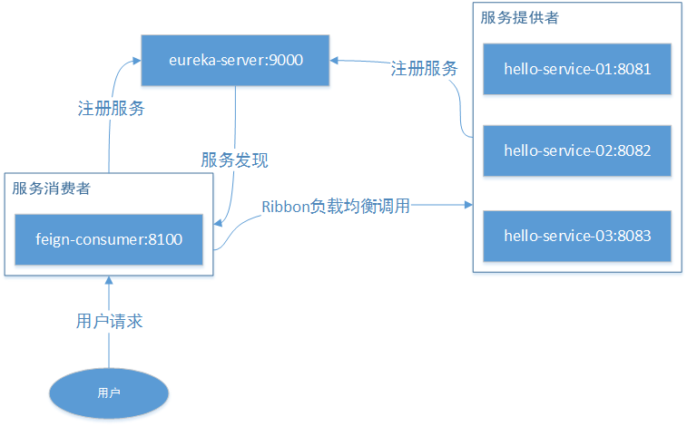

# Spring Cloud Feign 声明式服务调用



## 介绍

本示例主要介绍 Spring Cloud 系列中的 Eureka，实现快速入门

### Eureka Server

Eureka 是 Netflix 的子模块，它是一个基于 REST 的服务，用于定位服务，以实现云端中间层服务发现和故障转移。

服务注册和发现对于微服务架构而言，是非常重要的。有了服务发现和注册，只需要使用服务的标识符就可以访问到服务，而不需要修改服务调用的配置文件。该功能类似于 Dubbo 的注册中心，比如 Zookeeper。

Eureka 采用了 CS 的设计架构。Eureka Server 作为服务注册功能的服务端，它是服务注册中心。而系统中其他微服务则使用 Eureka 的客户端连接到 Eureka Server 并维持心跳连接

Eureka Server 提供服务的注册服务。各个服务节点启动后会在 Eureka Server 中注册服务，Eureka Server 中的服务注册表会存储所有可用的服务节点信息。

Eureka Client 是一个 Java 客户端，用于简化 Eureka Server 的交互，客户端同时也具备一个内置的、使用轮询负载算法的负载均衡器。在应用启动后，向 Eureka Server 发送心跳（默认周期 30 秒）。如果 Eureka Server 在多个心跳周期内没有接收到某个节点的心跳，Eureka Server 会从服务注册表中将该服务节点信息移除。

    简单理解：各个微服务将自己的信息注册到server上，需要调用的时候从server中获取到其他微服务信息
    
### Ribbon

Spring Cloud Ribbon 是基于 Netflix Ribbon 实现的一套客户端负载均衡工具，其主要功能是提供客户端的软件负载均衡算法，将 Netflix 的中间层服务连接在一起。

Ribbon 提供多种负载均衡策略：如轮询、随机、响应时间加权等。

### Feign

Feign是声明式、模板化的HTTP客户端，可以更加快捷优雅的调用HTTP API。在部分场景下和Ribbon类似，都是进行数据的请求处理，但是在请求参数使用实体类的时候显然更加方便，同时还支持安全性、授权控制等。
Feign是集成了Ribbon的，也就是说如果引入了Feign，那么Ribbon的功能也能使用，比如修改负载均衡策略等

## 代码实现

### 1.创建eureka-server服务

用来做服务注册中心

#### pom.xml pom配置

```xml
<?xml version="1.0" encoding="UTF-8"?>
<project xmlns="http://maven.apache.org/POM/4.0.0" xmlns:xsi="http://www.w3.org/2001/XMLSchema-instance"
         xsi:schemaLocation="http://maven.apache.org/POM/4.0.0 http://maven.apache.org/xsd/maven-4.0.0.xsd">
    <modelVersion>4.0.0</modelVersion>

    <groupId>com.easy</groupId>
    <artifactId>eureka-server</artifactId>
    <version>0.0.1-SNAPSHOT</version>
    <packaging>jar</packaging>

    <name>eureka-server</name>
    <description>Demo project for Spring Boot</description>

    <parent>
        <artifactId>cloud-feign</artifactId>
        <groupId>com.easy</groupId>
        <version>1.0.0</version>
    </parent>

    <dependencies>
        <dependency>
            <groupId>org.springframework.cloud</groupId>
            <artifactId>spring-cloud-starter-netflix-eureka-server</artifactId>
        </dependency>
        <dependency>
            <groupId>org.springframework.boot</groupId>
            <artifactId>spring-boot-starter-test</artifactId>
            <scope>test</scope>
        </dependency>
    </dependencies>

    <build>
        <plugins>
            <plugin>
                <groupId>org.springframework.boot</groupId>
                <artifactId>spring-boot-maven-plugin</artifactId>
            </plugin>
        </plugins>
    </build>
</project>

```

#### application.yml 配置文件

```yaml
server:
    port: 9000

spring:
  application:
    name: eureka-server
    
eureka:
    instance:
        hostname: localhost   # eureka 实例名称
    client:
        register-with-eureka: false # 不向注册中心注册自己
        fetch-registry: false       # 是否检索服务
        service-url:
            defaultZone: http://${eureka.instance.hostname}:${server.port}/eureka/  # 注册中心访问地址
```

#### EurekaServerApplication.java 启动类

```java
package com.easy.eurekaServer;

import org.springframework.boot.SpringApplication;
import org.springframework.boot.autoconfigure.SpringBootApplication;
import org.springframework.cloud.netflix.eureka.server.EnableEurekaServer;

@EnableEurekaServer
@SpringBootApplication
public class EurekaServerApplication {
    public static void main(String[] args) {
        SpringApplication.run(EurekaServerApplication.class, args);
    }
}

```

测试：http://localhost:8100/order/place?goodsId=2
服务注册中心：http://localhost:9000

### 2.创建hello-service-api接口

#### Result.java 统一返回实体

```java
package com.easy.helloServiceApi.vo;


import lombok.Getter;

import java.io.Serializable;

@Getter
public class Result implements Serializable {

    private static final long serialVersionUID = -8143412915723961070L;

    private int code;

    private String msg;

    private Object data;

    private Result() {
    }

    private Result(int code, String msg) {
        this.code = code;
        this.msg = msg;
    }

    private Result(int code, String msg, Object data) {
        this.code = code;
        this.msg = msg;
        this.data = data;
    }


    public static Result success() {
        return success(null);
    }

    public static Result success(Object data) {
        return new Result(200, "success", data);
    }

    public static Result fail() {
        return fail(500, "fail");
    }

    public static Result fail(int code, String message) {
        return new Result(code, message);
    }
}

```

#### Order.java 订单实体类

```java
package com.easy.helloServiceApi.model;

import lombok.AllArgsConstructor;
import lombok.Data;
import lombok.NoArgsConstructor;

/**
 * 订单类
 */
@Data
@NoArgsConstructor
@AllArgsConstructor
public class Order {

    private String orderId;

    private String goodsId;

    private int num;

}
```

#### 声明服务类

## 使用示例

1.
http://localhost:8100/goods/place?goodsId=1
http://localhost:9000/


## 资料

[参考资料](https://www.extlight.com/2018/07/10/Spring-Cloud-%E5%85%A5%E9%97%A8-%E4%B9%8B-Feign-%E7%AF%87%EF%BC%88%E4%B8%89%EF%BC%89/)
[官方资料](https://cloud.spring.io/spring-cloud-netflix/multi/multi_spring-cloud-feign.html)