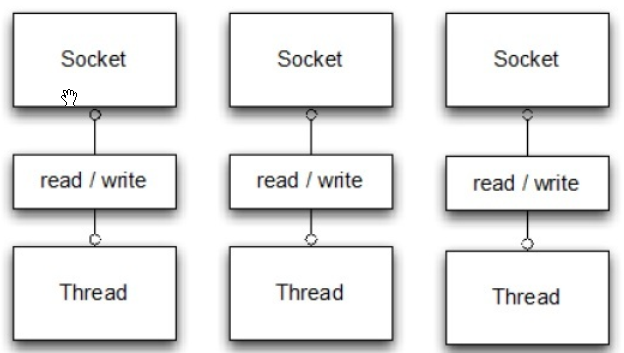
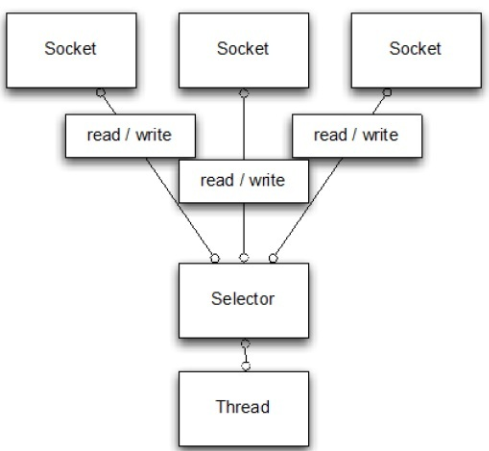

# Spring Boot 搭建TCP Server

本示例首先介绍Java原生API实现BIO通信，然后进阶实现NIO通信，最后利用Netty实现NIO通信及Netty主要模块组件介绍。

Netty 是一个异步事件驱动的网络应用程序框架，用于快速开发可维护的高性能协议服务器和客户端。

## BIO（Blocking I/O） 方案

BIO通信（一请求一应答）模型图如下



采用 BIO 通信模型 的服务端，通常由一个独立的 Acceptor 线程负责监听客户端的连接。我们一般通过在while(true) 循环中服务端会调用 accept() 方法等待接收客户端的连接的方式监听请求，一旦接收到一个连接请求，就可以在这个通信套接字上进行读写操作，此时不能再接收其他客户端连接请求，只能等待当前连接的客户端的操作执行完成， 如果要让 BIO 通信模型 能够同时处理多个客户端请求，就必须使用多线程（主要原因是socket.accept()、socket.read()、socket.write() 涉及的三个主要函数都是同步阻塞的）

### 代码实现

#### BIO服务端

BIOServer.java
```java
package com.easy.javaBio;

import lombok.SneakyThrows;
import lombok.extern.slf4j.Slf4j;

import java.io.BufferedReader;
import java.io.BufferedWriter;
import java.io.IOException;
import java.io.InputStreamReader;
import java.io.OutputStreamWriter;
import java.net.ServerSocket;
import java.net.Socket;

@Slf4j
public class BIOServer {
    public static void main(String[] args) throws IOException {
        ServerSocket server = new ServerSocket(10002);
        while (true) {
            Socket client = server.accept(); //等待客户端的连接，如果没有获取连接  ,在此步一直等待
            new Thread(new ServerThread(client)).start(); //为每个客户端连接开启一个线程
        }
        //server.close();
    }
}

@Slf4j
class ServerThread extends Thread {

    private Socket client;

    public ServerThread(Socket client) {
        this.client = client;
    }

    @SneakyThrows
    @Override
    public void run() {
        log.info("客户端:" + client.getInetAddress().getLocalHost() + "已连接到服务器");
        BufferedReader br = new BufferedReader(new InputStreamReader(client.getInputStream()));
        //读取客户端发送来的消息
        String mess = br.readLine();
        log.info("客户端：" + mess);
        BufferedWriter bw = new BufferedWriter(new OutputStreamWriter(client.getOutputStream()));
        bw.write(mess + "\n");
        bw.flush();
    }
}
```

#### BIO客户端

BIOClient.java
```java
package com.easy.javaBio;

import lombok.extern.slf4j.Slf4j;

import java.io.*;
import java.net.Socket;

@Slf4j
public class BIOClient {

    public static void main(String[] args) throws IOException {
        Socket s = new Socket("0.0.0.0", 10002);

        InputStream input = s.getInputStream();
        OutputStream output = s.getOutputStream();

        BufferedWriter bw = new BufferedWriter(new OutputStreamWriter(output));
        bw.write("客户端给服务端发消息测试\n");  //向服务器端发送一条消息
        bw.flush();

        BufferedReader br = new BufferedReader(new InputStreamReader(input));  //读取服务器返回的消息
        String mess = br.readLine();
        log.info("服务器：" + mess);
    }
}
```

### 运行示例

运行BIO服务端，然后再运行BIO客户端，观察控制台

BIOServer控制台输出：
```cfml
Connected to the target VM, address: '127.0.0.1:64346', transport: 'socket'
17:29:52.519 [Thread-1] INFO com.easy.javaBio.ServerThread - 客户端:YHE6OR5UXQJ6D35/192.168.9.110已连接到服务器
17:29:52.523 [Thread-1] INFO com.easy.javaBio.ServerThread - 客户端：客户端给服务端发消息测试
```

BIOClient控制台输出:
```cfml
Connected to the target VM, address: '127.0.0.1:64355', transport: 'socket'
17:29:52.527 [main] INFO com.easy.javaBio.BIOClient - 服务器：客户端给服务端发消息测试
Disconnected from the target VM, address: '127.0.0.1:64355', transport: 'socket'
```

这表示我们实现了一个最简单的BIO通信了

这种方式为每个客户端开启一个线程，高并发时消耗资源较多，容易浪费，甚至导致服务端崩溃，对性能造成负面影响，高并发下不推荐使用。

## NIO（New I/O）方案

NIO通信模型图如下



NIO是一种同步非阻塞的I/O模型，在Java 1.4 中引入了 NIO 框架，对应 java.nio 包，提供了 Channel , Selector，Buffer等抽象。

NIO中的N可以理解为Non-blocking，不单纯是New。它支持面向缓冲的，基于通道的I/O操作方法。 NIO提供了与传统BIO模型中的 Socket 和 ServerSocket 相对应的 SocketChannel 和 ServerSocketChannel 两种不同的套接字通道实现,两种通道都支持阻塞和非阻塞两种模式。阻塞模式使用就像传统中的支持一样，比较简单，但是性能和可靠性都不好；非阻塞模式正好与之相反。对于低负载、低并发的应用程序，可以使用同步阻塞I/O来提升开发速率和更好的维护性；对于高负载、高并发的（网络）应用，应使用 NIO 的非阻塞模式来开发。

### NIO服务端

NIOServer.java
```java
package com.easy.javaBio;

import lombok.extern.slf4j.Slf4j;

import java.io.IOException;
import java.net.InetAddress;
import java.net.InetSocketAddress;
import java.net.Socket;
import java.net.SocketAddress;
import java.nio.ByteBuffer;
import java.nio.channels.SelectionKey;
import java.nio.channels.Selector;
import java.nio.channels.ServerSocketChannel;
import java.nio.channels.SocketChannel;
import java.util.*;

@Slf4j
public class NIOServer {
    private InetAddress addr;
    private int port;
    private Selector selector;

    private static int BUFF_SIZE = 1024;

    public NIOServer(InetAddress addr, int port) throws IOException {
        this.addr = addr;
        this.port = port;
        startServer();
    }

    private void startServer() throws IOException {
        // 获得selector及通道(socketChannel)
        this.selector = Selector.open();
        ServerSocketChannel serverChannel = ServerSocketChannel.open();
        serverChannel.configureBlocking(false);

        // 绑定地址及端口
        InetSocketAddress listenAddr = new InetSocketAddress(this.addr, this.port);
        serverChannel.socket().bind(listenAddr);
        serverChannel.register(this.selector, SelectionKey.OP_ACCEPT);

        log.info("NIOServer运行中...按下Ctrl-C停止服务");

        while (true) {
            log.info("服务器等待新的连接和selector选择…");
            this.selector.select();

            // 选择key工作
            Iterator keys = this.selector.selectedKeys().iterator();
            while (keys.hasNext()) {
                SelectionKey key = (SelectionKey) keys.next();

                // 防止出现重复的key，处理完需及时移除
                keys.remove();

                //无效直接跳过
                if (!key.isValid()) {
                    continue;
                }
                if (key.isAcceptable()) {
                    this.accept(key);
                } else if (key.isReadable()) {
                    this.read(key);
                } else if (key.isWritable()) {
                    this.write(key);
                } else if (key.isConnectable()) {
                    this.connect(key);
                }
            }
        }
    }

    private void connect(SelectionKey key) throws IOException {
        SocketChannel channel = (SocketChannel) key.channel();
        if (channel.finishConnect()) {
            // 成功
            log.info("成功连接了");
        } else {
            // 失败
            log.info("失败连接");
        }
    }

    private void accept(SelectionKey key) throws IOException {
        ServerSocketChannel serverChannel = (ServerSocketChannel) key.channel();
        SocketChannel channel = serverChannel.accept();
        channel.configureBlocking(false);
        channel.register(this.selector, SelectionKey.OP_READ);

        Socket socket = channel.socket();
        SocketAddress remoteAddr = socket.getRemoteSocketAddress();
        log.info("连接到: " + remoteAddr);
    }

    private void read(SelectionKey key) throws IOException {
        SocketChannel channel = (SocketChannel) key.channel();

        ByteBuffer buffer = ByteBuffer.allocate(BUFF_SIZE);
        int numRead = channel.read(buffer);
        if (numRead == -1) {
            log.info("关闭客户端连接: " + channel.socket().getRemoteSocketAddress());
            channel.close();
            return;
        }
        String msg = new String(buffer.array()).trim();
        log.info("得到了: " + msg);

        // 回复客户端
        String reMsg = msg + " 你好，这是BIOServer给你的回复消息:" + System.currentTimeMillis();
        channel.write(ByteBuffer.wrap(reMsg.getBytes()));
    }

    private void write(SelectionKey key) throws IOException {
        ByteBuffer byteBuffer = ByteBuffer.allocate(BUFF_SIZE);
        byteBuffer.flip();
        SocketChannel clientChannel = (SocketChannel) key.channel();
        while (byteBuffer.hasRemaining()) {
            clientChannel.write(byteBuffer);
        }
        byteBuffer.compact();
    }

    public static void main(String[] args) throws IOException {
        new NIOServer(null, 10002);
    }
}
```

使用NIO, 可以用Selector最终决定哪一组注册的socket准备执行I/O

### NIO客户端

NIOClient.java
```java
package com.easy.javaBio;

import lombok.extern.slf4j.Slf4j;

import java.io.IOException;
import java.net.InetSocketAddress;
import java.nio.ByteBuffer;
import java.nio.channels.SocketChannel;
import java.util.ArrayList;

@Slf4j
public class NIOClient {
    private static int BUFF_SIZE = 1024;

    public static void main(String[] args) throws IOException, InterruptedException {

        InetSocketAddress socketAddress = new InetSocketAddress("0.0.0.0", 10002);
        SocketChannel socketChannel = SocketChannel.open(socketAddress);

        log.info("连接 BIOServer 服务，端口：10002...");

        ArrayList<String> companyDetails = new ArrayList<>();

        // 创建消息列表
        companyDetails.add("腾讯");
        companyDetails.add("阿里巴巴");
        companyDetails.add("京东");
        companyDetails.add("百度");
        companyDetails.add("google");

        for (String companyName : companyDetails) {
            socketChannel.write(ByteBuffer.wrap(companyName.getBytes()));
            log.info("发送: " + companyName);

            ByteBuffer buffer = ByteBuffer.allocate(BUFF_SIZE);
            buffer.clear();
            socketChannel.read(buffer);
            String result = new String(buffer.array()).trim();
            log.info("收到NIOServer回复的消息：" + result);

            // 等待2秒钟再发送下一条消息
            Thread.sleep(2000);
        }

        socketChannel.close();
    }
}
```

### 运行示例

首先运行我们的NIOServer，然后再运行NIOClient，观察控制台输出

NIOServer控制台输出
```cfml
17:35:40.921 [main] INFO com.easy.javaBio.NIOServer - NIOServer运行中...按下Ctrl-C停止服务
17:35:40.924 [main] INFO com.easy.javaBio.NIOServer - 服务器等待新的连接和selector选择…
17:36:29.188 [main] INFO com.easy.javaBio.NIOServer - 连接到: /192.168.9.110:64443
17:36:29.188 [main] INFO com.easy.javaBio.NIOServer - 服务器等待新的连接和selector选择…
17:36:29.194 [main] INFO com.easy.javaBio.NIOServer - 得到了: 腾讯
17:36:29.194 [main] INFO com.easy.javaBio.NIOServer - 服务器等待新的连接和selector选择…
17:36:31.194 [main] INFO com.easy.javaBio.NIOServer - 得到了: 阿里巴巴
17:36:31.195 [main] INFO com.easy.javaBio.NIOServer - 服务器等待新的连接和selector选择…
17:36:33.195 [main] INFO com.easy.javaBio.NIOServer - 得到了: 京东
17:36:33.195 [main] INFO com.easy.javaBio.NIOServer - 服务器等待新的连接和selector选择…
17:36:35.196 [main] INFO com.easy.javaBio.NIOServer - 得到了: 百度
17:36:35.197 [main] INFO com.easy.javaBio.NIOServer - 服务器等待新的连接和selector选择…
17:36:37.197 [main] INFO com.easy.javaBio.NIOServer - 得到了: google
17:36:37.198 [main] INFO com.easy.javaBio.NIOServer - 服务器等待新的连接和selector选择…
17:36:39.198 [main] INFO com.easy.javaBio.NIOServer - 关闭客户端连接: /192.168.9.110:64443
17:36:39.198 [main] INFO com.easy.javaBio.NIOServer - 服务器等待新的连接和selector选择…
```

NIOClient控制台输出
```cfml
17:36:29.189 [main] INFO com.easy.javaBio.NIOClient - 连接 BIOServer 服务，端口：10002...
17:36:29.194 [main] INFO com.easy.javaBio.NIOClient - 发送: 腾讯
17:36:29.194 [main] INFO com.easy.javaBio.NIOClient - 收到NIOServer回复的消息：腾讯 你好，这是BIOServer给你的回复消息:1576229789194
17:36:31.194 [main] INFO com.easy.javaBio.NIOClient - 发送: 阿里巴巴
17:36:31.195 [main] INFO com.easy.javaBio.NIOClient - 收到NIOServer回复的消息：阿里巴巴 你好，这是BIOServer给你的回复消息:1576229791194
17:36:33.195 [main] INFO com.easy.javaBio.NIOClient - 发送: 京东
17:36:33.196 [main] INFO com.easy.javaBio.NIOClient - 收到NIOServer回复的消息：京东 你好，这是BIOServer给你的回复消息:1576229793195
17:36:35.196 [main] INFO com.easy.javaBio.NIOClient - 发送: 百度
17:36:35.197 [main] INFO com.easy.javaBio.NIOClient - 收到NIOServer回复的消息：百度 你好，这是BIOServer给你的回复消息:1576229795197
17:36:37.197 [main] INFO com.easy.javaBio.NIOClient - 发送: google
17:36:37.198 [main] INFO com.easy.javaBio.NIOClient - 收到NIOServer回复的消息：google 你好，这是BIOServer给你的回复消息:1576229797198
```

NIO服务端每隔两秒会收到客户端的请求，并对客户端的消息做出回复。

直接使用Java NIO API构建应用程序是可以的，但要做到正确和安全并不容易。特别是在高负载下，可靠和高效地处理和调度I/O操作是一项繁琐而且容易出错的任务。可以选中Netty, Apache Mina等高性能网络编程框架。

## Netty 构建 NIO 通信服务 方案

### 使用JDK原生网络应用程序API，会存在的问题

- NIO的类库和API繁杂，使用麻烦，你需要熟练掌握Selector、ServerSocketChannel、SocketChannel、ByteBuffer等

- 需要具备其它的额外技能做铺垫，例如熟悉Java多线程编程，因为NIO编程涉及到Reactor模式，你必须对多线程和网路编程非常熟悉，才能编写出高质量的NIO程序

- 可靠性能力补齐，开发工作量和难度都非常大。例如客户端面临断连重连、网络闪断、半包读写、失败缓存、网络拥塞和异常码流的处理等等，NIO编程的特点是功能开发相对容易，但是可靠性能力补齐工作量和难度都非常大

### Netty对JDK自带的NIO的API进行封装，解决上述问题，主要特点有

- 高并发

Netty是一款基于NIO（Nonblocking I/O，非阻塞IO）开发的网络通信框架，对比于BIO（Blocking I/O，阻塞IO），他的并发性能得到了很大提高 。

- 传输快

Netty的传输快其实也是依赖了NIO的一个特性——零拷贝。

- 封装好

Netty封装了NIO操作的很多细节，提供易于使用的API。

### Netty框架的优势

- API使用简单，开发门槛低；
- 功能强大，预置了多种编解码功能，支持多种主流协议；
- 定制能力强，可以通过ChannelHandler对通信框架进行灵活地扩展；
- 性能高，通过与其他业界主流的NIO框架对比，Netty的综合性能最优；
- 成熟、稳定，Netty修复了已经发现的所有JDK NIO BUG，业务开发人员不需要再为NIO的BUG而烦恼；
- 社区活跃，版本迭代周期短，发现的BUG可以被及时修复，同时，更多的新功能会加入；
- 经历了大规模的商业应用考验，质量得到验证。在互联网、大数据、网络游戏、企业应用、电信软件等众多行业得到成功商用，证明了它已经完全能够满足不同行业的商业应用了。

### 代码实现

pom.xml依赖
```xml
<?xml version="1.0" encoding="UTF-8"?>
<project xmlns="http://maven.apache.org/POM/4.0.0" xmlns:xsi="http://www.w3.org/2001/XMLSchema-instance"
         xsi:schemaLocation="http://maven.apache.org/POM/4.0.0 http://maven.apache.org/xsd/maven-4.0.0.xsd">
    <modelVersion>4.0.0</modelVersion>
    <parent>
        <groupId>org.springframework.boot</groupId>
        <artifactId>spring-boot-starter-parent</artifactId>
        <version>2.1.9.RELEASE</version>
        <relativePath/> <!-- lookup parent from repository -->
    </parent>
    <groupId>com.easy</groupId>
    <artifactId>netty</artifactId>
    <version>0.0.1</version>
    <name>netty</name>
    <description>Demo project for Spring Boot</description>

    <properties>
        <java.version>1.8</java.version>
        <encoding>UTF-8</encoding>
        <project.build.sourceEncoding>UTF-8</project.build.sourceEncoding>
        <project.reporting.outputEncoding>UTF-8</project.reporting.outputEncoding>
    </properties>

    <dependencies>
        <!-- https://mvnrepository.com/artifact/io.netty/netty-all -->
        <dependency>
            <groupId>io.netty</groupId>
            <artifactId>netty-all</artifactId>
            <version>4.1.43.Final</version>
        </dependency>

        <dependency>
            <groupId>org.springframework.boot</groupId>
            <artifactId>spring-boot-starter-test</artifactId>
            <scope>test</scope>
        </dependency>

        <dependency>
            <groupId>org.projectlombok</groupId>
            <artifactId>lombok</artifactId>
            <scope>compile</scope>
        </dependency>
    </dependencies>

    <modules>
        <module>java-tcp</module>
        <module>netty-server</module>
        <module>netty-client</module>
    </modules>

    <build>
        <plugins>
            <plugin>
                <groupId>org.springframework.boot</groupId>
                <artifactId>spring-boot-maven-plugin</artifactId>
            </plugin>
        </plugins>
    </build>
</project>
```

#### 搭建 Netty 服务端

NettyServer.java
```java
package com.easy.nettyServer;

import io.netty.bootstrap.ServerBootstrap;
import io.netty.channel.ChannelFuture;
import io.netty.channel.ChannelOption;
import io.netty.channel.EventLoopGroup;
import io.netty.channel.nio.NioEventLoopGroup;
import io.netty.channel.socket.nio.NioServerSocketChannel;
import lombok.extern.slf4j.Slf4j;
import org.springframework.beans.factory.annotation.Value;
import org.springframework.stereotype.Component;

import javax.annotation.PostConstruct;
import javax.annotation.PreDestroy;
import java.net.InetSocketAddress;

@Component
@Slf4j
public class NettyServer {
    /**
     * boss 线程组用于处理连接工作
     */
    private EventLoopGroup boss = new NioEventLoopGroup();
    /**
     * work 线程组用于数据处理
     */
    private EventLoopGroup work = new NioEventLoopGroup();

    @Value("${netty.port}")
    private Integer port;

    /**
     * 启动Netty Server
     *
     * @throws InterruptedException
     */
    @PostConstruct
    public void start() throws InterruptedException {
        ServerBootstrap bootstrap = new ServerBootstrap();
        bootstrap.group(boss, work)
                // 指定Channel
                .channel(NioServerSocketChannel.class)
                //使用指定的端口设置套接字地址
                .localAddress(new InetSocketAddress(port))

                //服务端可连接队列数,对应TCP/IP协议listen函数中backlog参数
                .option(ChannelOption.SO_BACKLOG, 1024)

                //设置TCP长连接,一般如果两个小时内没有数据的通信时,TCP会自动发送一个活动探测数据报文
                .childOption(ChannelOption.SO_KEEPALIVE, true)

                //将小的数据包包装成更大的帧进行传送，提高网络的负载
                .childOption(ChannelOption.TCP_NODELAY, true)

                .childHandler(new ServerChannelInitializer());
        ChannelFuture future = bootstrap.bind().sync();
        if (future.isSuccess()) {
            log.info("启动 Netty Server");
        }
    }

    @PreDestroy
    public void destory() throws InterruptedException {
        boss.shutdownGracefully().sync();
        work.shutdownGracefully().sync();
        log.info("关闭Netty");
    }
}
```

NettyServerHandler.java
```java
package com.easy.nettyServer;

import io.netty.channel.ChannelHandlerContext;
import io.netty.channel.ChannelInboundHandlerAdapter;
import lombok.extern.slf4j.Slf4j;

@Slf4j
public class NettyServerHandler extends ChannelInboundHandlerAdapter {
    /**
     * 客户端连接会触发
     */
    @Override
    public void channelActive(ChannelHandlerContext ctx) throws Exception {
        log.info("Channel active......");
    }

    /**
     * 客户端发消息会触发
     */
    @Override
    public void channelRead(ChannelHandlerContext ctx, Object msg) throws Exception {
        log.info("服务器收到消息: {}", msg.toString());
        ctx.write("我是服务端，我收到你的消息了！");
        ctx.flush();
    }

    /**
     * 发生异常触发
     */
    @Override
    public void exceptionCaught(ChannelHandlerContext ctx, Throwable cause) throws Exception {
        cause.printStackTrace();
        ctx.close();
    }
}
```

ServerChannelInitializer.java
```java
package com.easy.nettyServer;

import io.netty.channel.ChannelInitializer;
import io.netty.channel.socket.SocketChannel;
import io.netty.handler.codec.string.StringDecoder;
import io.netty.handler.codec.string.StringEncoder;
import io.netty.util.CharsetUtil;

public class ServerChannelInitializer extends ChannelInitializer<SocketChannel> {
    @Override
    protected void initChannel(SocketChannel socketChannel) throws Exception {
        //添加编解码
        socketChannel.pipeline().addLast("decoder", new StringDecoder(CharsetUtil.UTF_8));
        socketChannel.pipeline().addLast("encoder", new StringEncoder(CharsetUtil.UTF_8));
        socketChannel.pipeline().addLast(new NettyServerHandler());
    }
}
```

#### 创建 Netty 客户端

NettyClient.java
```java
package com.easy.nettyClient;

import io.netty.bootstrap.Bootstrap;
import io.netty.channel.ChannelFuture;
import io.netty.channel.ChannelFutureListener;
import io.netty.channel.ChannelOption;
import io.netty.channel.EventLoopGroup;
import io.netty.channel.nio.NioEventLoopGroup;
import io.netty.channel.socket.SocketChannel;
import io.netty.channel.socket.nio.NioSocketChannel;
import lombok.extern.slf4j.Slf4j;
import org.springframework.beans.factory.annotation.Value;
import org.springframework.stereotype.Component;

import javax.annotation.PostConstruct;
import java.util.concurrent.TimeUnit;

@Component
@Slf4j
public class NettyClient {

    private EventLoopGroup group = new NioEventLoopGroup();

    @Value("${netty.port}")
    private Integer port;

    @Value("${netty.host}")
    private String host;

    private SocketChannel socketChannel;

    /**
     * 发送消息
     */
    public void sendMsg(String msg) {
        socketChannel.writeAndFlush(msg);
    }

    @PostConstruct
    public void start() {
        Bootstrap bootstrap = new Bootstrap();
        bootstrap.group(group)
                .channel(NioSocketChannel.class)
                .remoteAddress(host, port)
                .option(ChannelOption.SO_KEEPALIVE, true)
                .option(ChannelOption.TCP_NODELAY, true)
                .handler(new NettyClientInitializer());
        ChannelFuture future = bootstrap.connect();
        //客户端断线重连逻辑
        future.addListener((ChannelFutureListener) future1 -> {
            if (future1.isSuccess()) {
                log.info("连接Netty服务端成功");
            } else {
                log.info("连接失败，进行断线重连");
                future1.channel().eventLoop().schedule(() -> start(), 20, TimeUnit.SECONDS);
            }
        });
        socketChannel = (SocketChannel) future.channel();
    }
}

```

NettyClientHandler.java
```java
package com.easy.nettyClient;

import io.netty.channel.ChannelHandlerContext;
import io.netty.channel.ChannelInboundHandlerAdapter;
import lombok.extern.slf4j.Slf4j;

@Slf4j
public class NettyClientHandler extends ChannelInboundHandlerAdapter {
    @Override
    public void channelActive(ChannelHandlerContext ctx) throws Exception {
        log.info("客户端Active .....");
    }

    @Override
    public void channelRead(ChannelHandlerContext ctx, Object msg) throws Exception {
        log.info("客户端收到消息: {}", msg.toString());
    }

    @Override
    public void exceptionCaught(ChannelHandlerContext ctx, Throwable cause) throws Exception {
        cause.printStackTrace();
        ctx.close();
    }
}
```

NettyClientInitializer.java
```java
package com.easy.nettyClient;

import io.netty.channel.ChannelInitializer;
import io.netty.channel.socket.SocketChannel;
import io.netty.handler.codec.string.StringDecoder;
import io.netty.handler.codec.string.StringEncoder;

public class NettyClientInitializer extends ChannelInitializer<SocketChannel> {
    @Override
    protected void initChannel(SocketChannel socketChannel) throws Exception {
        socketChannel.pipeline().addLast("decoder", new StringDecoder());
        socketChannel.pipeline().addLast("encoder", new StringEncoder());
        socketChannel.pipeline().addLast(new NettyClientHandler());
    }
}
```

### 运行示例

打开浏览器，地址栏输入：http://localhost:8091/send?msg=%E4%BD%A0%E5%A5%BD，观察服务端和客户端控制台

服务端控制台输出
```java
2019-12-13 18:01:37.901  INFO 11288 --- [           main] com.easy.nettyServer.NettyServer         : 启动 Netty Server
2019-12-13 18:01:45.834  INFO 11288 --- [ntLoopGroup-3-1] com.easy.nettyServer.NettyServerHandler  : Channel active......
2019-12-13 18:02:07.858  INFO 11288 --- [ntLoopGroup-3-1] com.easy.nettyServer.NettyServerHandler  : 服务器收到消息: 你好
```

客户端控制台输出
```java
2019-12-13 18:01:45.822  INFO 11908 --- [ntLoopGroup-2-1] com.easy.nettyClient.NettyClient         : 连接Netty服务端成功
2019-12-13 18:01:45.822  INFO 11908 --- [ntLoopGroup-2-1] com.easy.nettyClient.NettyClientHandler  : 客户端Active .....
2019-12-13 18:02:08.005  INFO 11908 --- [ntLoopGroup-2-1] com.easy.nettyClient.NettyClientHandler  : 客户端收到消息: 我是服务端，我收到你的消息了！
```

表示使用Netty实现了我们的NIO通信了

## Netty 模块组件

### Bootstrap、ServerBootstrap

一个Netty应用通常由一个Bootstrap开始，主要作用是配置整个Netty程序，串联各个组件，Netty中Bootstrap类是客户端程序的启动引导类，ServerBootstrap是服务端启动引导类。

### Future、ChannelFuture

在Netty中所有的IO操作都是异步的，不能立刻得知消息是否被正确处理，但是可以过一会等它执行完成或者直接注册一个监听，具体的实现就是通过Future和ChannelFuture，他们可以注册一个监听，当操作执行成功或失败时监听会自动触发注册的监听事件。

### Channel

Netty网络通信组件，能够用于执行网络I/O操作。Channel为用户提供：

- 当前网络连接的通道的状态（例如是否打开？是否已连接？）
- 网络连接的配置参数 （例如接收缓冲区大小）
- 提供异步的网络I/O操作(如建立连接，读写，绑定端口)，异步调用意味着任何I/O调用都将立即返回，并且不保证在调用结束时所请求的I/O操作已完成。调用立即返回一个ChannelFuture实例，通过注册监听器到ChannelFuture上，可以I/O操作成功、失败或取消时回调通知调用方。
- 支持关联I/O操作与对应的处理程序

不同协议、不同阻塞类型的连接都有不同的 Channel 类型与之对应，下面是一些常用的 Channel 类型

- NioSocketChannel，异步的客户端 TCP Socket 连接
- NioServerSocketChannel，异步的服务器端 TCP Socket 连接
- NioDatagramChannel，异步的 UDP 连接
- NioSctpChannel，异步的客户端 Sctp 连接
- NioSctpServerChannel，异步的 Sctp 服务器端连接

### Selector

Netty基于Selector对象实现I/O多路复用，通过 Selector, 一个线程可以监听多个连接的Channel事件, 当向一个Selector中注册Channel 后，Selector 内部的机制就可以自动不断地查询(select) 这些注册的Channel是否有已就绪的I/O事件(例如可读, 可写, 网络连接完成等)，这样程序就可以很简单地使用一个线程高效地管理多个 Channel 

### NioEventLoop

NioEventLoop中维护了一个线程和任务队列，支持异步提交执行任务，线程启动时会调用NioEventLoop的run方法，执行I/O任务和非I/O任务：

- I/O任务 即selectionKey中ready的事件，如accept、connect、read、write等，由processSelectedKeys方法触发。
- 非IO任务 添加到taskQueue中的任务，如register0、bind0等任务，由runAllTasks方法触发。

两种任务的执行时间比由变量ioRatio控制，默认为50，则表示允许非IO任务执行的时间与IO任务的执行时间相等。

### NioEventLoopGroup

NioEventLoopGroup，主要管理eventLoop的生命周期，可以理解为一个线程池，内部维护了一组线程，每个线程(NioEventLoop)负责处理多个Channel上的事件，而一个Channel只对应于一个线程。

### ChannelHandler

ChannelHandler是一个接口，处理I/O事件或拦截I/O操作，并将其转发到其ChannelPipeline(业务处理链)中的下一个处理程序。

### ChannelHandlerContext

保存Channel相关的所有上下文信息，同时关联一个ChannelHandler对象

### ChannelPipline

保存ChannelHandler的List，用于处理或拦截Channel的入站事件和出站操作。 ChannelPipeline实现了一种高级形式的拦截过滤器模式，使用户可以完全控制事件的处理方式，以及Channel中各个的ChannelHandler如何相互交互。

## 资料

- [netty 示例源码](https://github.com/smltq/spring-boot-demo/blob/master/netty)
- [netty官网](https://netty.io/)
- [参考](https://juejin.im/post/5bea1d2e51882523d3163657)